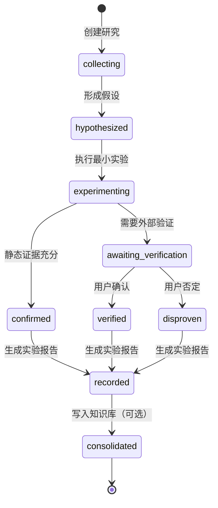

# Research Trace：Agent 驱动研究过程可视化设计

## 1. 背景与目标

MHXX AI Research Studio 已提供偏移表、Hex 查看、内存补丁、diff、实验记录与知识库能力，但 Agent 的研究过程仍分散在 API 调用、实验 Markdown 和用户对话中。

本设计新增 **Research Trace（研究轨迹）**：它将一次研究中的事实、实验动作、证据、人工验证交接和结论组织为可审计的时间线。

目标：

- 让用户能在界面中看到 Agent 正在研究什么、依据是什么、下一步需要谁完成。
- 让 Agent 可以从未完成研究中可靠续作，而不是重新猜测上下文。
- 保持当前 MHXX 二进制研究体验，同时让底层过程可复用于其他实验型任务。
- 记录可验证的动作与证据；不存储模型私有思维过程或未经证实的长篇推理。

非目标：

- 不在应用中内置大模型或自动调用模型。
- 不自动完成游戏内动态验证。
- 不取代现有 `experiments/*.md` 和 `data/knowledge/*.md`。

## 2. 总体结构

```text
MHXX 专用工作台
偏移表 / 角色槽 / Hex / 存档补丁 / diff
                    │
                    ▼
Research Trace 模块
研究状态 / 事件 / 证据 / 人工交接 / 结论
                    │
                    ▼
实验动作 Adapter
二进制补丁 / 存档 diff / 人工验证
                    │
                    ▼
研究产物
轨迹 JSON / 实验报告 Markdown / 知识库 Markdown
```

### 2.1 模块边界

`Research Trace` 是一个深模块：外部调用者只需要创建研究、追加事件、读取轨迹、提交验证结果、结束研究；事件关联、状态迁移、报告生成及知识库写入条件由模块内部处理。

该模块的外部接口不应泄露 Web UI 的细节，也不要求调用方了解 Markdown 文件名、JSON 存储路径或每个状态的所有转换规则。

## 3. 研究生命周期



| 状态 | 含义 | 可写入知识库 |
| --- | --- | --- |
| `collecting` | 正在收集上下文和原始证据 | 否 |
| `hypothesized` | 已有可证伪假设，但未做实验 | 否 |
| `experimenting` | 已执行或正在分析最小实验 | 否 |
| `awaiting_verification` | 需要用户或外部系统验证 | 否 |
| `confirmed` | 静态证据逻辑自洽 | 可以，必须标记 `CONFIRMED` |
| `verified` | 已获得游戏内动态验证 | 可以，标记 `VERIFIED` |
| `disproven` | 假设被明确否定 | 否；应保留实验报告 |
| `recorded` | 已生成实验报告 | 取决于结论 |
| `consolidated` | 已将结论固化到知识库 | 已完成 |

## 4. 数据模型

### 4.1 Research

```json
{
  "id": "funds-offset-20260819",
  "title": "验证槽 1 +0x24 是否为金钱",
  "subject": {
    "type": "mhxx-save",
    "name": "system",
    "context": { "slot": 1, "base_offset": "0x126474" }
  },
  "status": "awaiting_verification",
  "claim": {
    "statement": "+0x24 是 uint32 little-endian 金钱",
    "confidence": "hypothesis"
  },
  "created_at": "2026-08-19T10:00:00+08:00",
  "updated_at": "2026-08-19T10:06:00+08:00"
}
```

`subject` 保留为通用对象描述。MHXX 的槽位、基址等信息存放在 `context`，不进入通用状态机。

### 4.2 TraceEvent
as
```json
{
  "id": "evt_003",
  "research_id": "funds-offset-20260819",
  "at": "2026-08-19T10:05:00+08:00",
  "type": "action_executed",
  "actor": "agent",
  "status": "completed",
  "summary": "向金钱候选位置写入 123456",
  "payload": {
    "adapter": "binary_patch",
    "target": "0x126498",
    "before": "4F3F7500",
    "after": "40E20100"
  },
  "links": {
    "experiment": null,
    "knowledge": null
  }
}
```

允许的事件类型：

- `context_collected`：读取偏移、常量、存档字节或环境信息。
- `hypothesis_created`：提出可证伪的字段或结构假设。
- `action_executed`：执行一次实验动作。
- `evidence_observed`：记录 diff、日志、截图引用或计算结果。
- `verification_requested`：产生需要人类或外部系统完成的验证任务。
- `verification_received`：接收验证结果和备注。
- `conclusion_reached`：结论为 `HYPOTHESIS`、`CONFIRMED`、`VERIFIED` 或 `DISPROVEN`。
- `artifact_created`：生成补丁、报告或下载文件。
- `knowledge_consolidated`：追加或更新知识库。

## 5. 实验动作 Adapter

Adapter 用于隔离研究轨迹和领域具体操作。第一期只实现以下三个 Adapter。

| Adapter | 封装能力 | 结果 |
| --- | --- | --- |
| `binary_patch` | 读取指定字节、向内存副本打补丁 | 修改前后字节、绝对偏移 |
| `save_diff` | 对比加载快照和工作副本，或比较两份存档 | 差异数与差异列表 |
| `human_verification` | 创建游戏内验证待办、接收用户确认或否定 | 验证结果、备注、附件引用 |

未来可以新增 `shell_command`、`http_request`、`database_query` 或 `file_compare`，而不改变研究轨迹的界面与状态机。

## 6. 后端接口

```text
POST /api/researches
GET  /api/researches
GET  /api/researches/<id>
POST /api/researches/<id>/events
POST /api/researches/<id>/verification
POST /api/researches/<id>/conclude
POST /api/researches/<id>/report
POST /api/researches/<id>/consolidate
```

建议行为：

- `POST /api/researches` 创建研究并写入初始 `context_collected` 事件。
- `POST /api/researches/<id>/events` 允许 Agent 追加明确的事实、假设和证据。
- 调用现有 `/api/save/patch` 成功后，若存在当前活动研究，服务端自动追加 `action_executed`。
- 调用现有 `/api/save/diff` 时，前端可选择“附加到当前研究”；服务端保存摘要及完整差异引用。
- `POST /verification` 只接受用户可见的结果、备注及附件引用，不能由 Agent 自行标记动态验证成功。
- `POST /conclude` 校验状态迁移；`VERIFIED` 必须至少存在一个用户验证事件。
- `POST /report` 将轨迹整理为现有格式的实验 Markdown。
- `POST /consolidate` 仅允许 `CONFIRMED` 或 `VERIFIED`；默认只对 `VERIFIED` 显示主操作按钮。

## 7. 存储与产物

```text
experiments/
  traces/
    funds-offset-20260819.json
  20260819_验证金钱偏移.md

data/
  knowledge/
    known-offsets.md
```

- `traces/*.json`：机器可读，保存完整状态、事件和引用，作为界面时间线的唯一数据源。
- `experiments/*.md`：人类可读的实验报告，可提交版本控制。
- `knowledge/*.md`：长期有效的知识，仅记录带证据等级的结论。

任何轨迹 JSON 更新应采用原子写入（临时文件后替换），避免服务中断留下损坏记录。

## 8. 前端交互

在右栏“实验记录”上方增加可折叠的“当前研究”面板：

```text
当前研究：验证 FUNDS_OFFSET 为金钱                         [新建研究]

● 已读取证据                                      完成
  槽 1 基址：0x126474；原值：4F 3F 75 00

● 假设                                            完成
  +0x24 是槽相对 uint32 LE 金钱。

● 最小补丁                                        完成
  0x126498：4F 3F 75 00 → 40 E2 01 00
  [跳到 Hex] [查看 Diff]

◐ 等待游戏内验证                                  需要用户
  导入修改后的存档，打开角色 1，确认金钱是否为 123,456。
  [确认符合] [不符合] [添加备注]

○ 固化知识                                        未开始
```

交互原则：

- 每项只展示简短事实、理由和下一步，不展示模型的私有推理链。
- 时间线节点支持展开，查看原始字节、diff、关联文件和时间。
- 所有需要用户完成的节点必须有明确操作、预期观察结果和结果输入。
- Hex、补丁和 diff 页面提供“关联到当前研究”按钮。
- 没有活动研究时，手工补丁仍可使用；界面只提示“此操作未记录到研究轨迹”。

## 9. Agent 工作协议

1. 创建研究，指定对象、目标字段、角色槽和初始问题。
2. 读取偏移、常量与原始字节，记录 `context_collected`。
3. 写入一句可证伪假设，记录 `hypothesis_created`。
4. 只执行一个最小实验；补丁和 diff 自动或手工关联到轨迹。
5. 以静态证据更新研究；证据不足时创建 `verification_requested`。
6. 用户返回游戏内结果后，写入 `verification_received`。
7. 将结论设为 `CONFIRMED`、`VERIFIED` 或 `DISPROVEN`，并生成报告。
8. 仅在证据满足要求时固化知识库。

## 10. 实施分期

### 第一阶段：轨迹基础

- 实现 Research / TraceEvent JSON 存储和 CRUD 接口。
- 实现活动研究选择、创建研究、时间线读取与手工追加事件。
- 增加基础测试：状态迁移、事件校验、原子写入。

### 第二阶段：与现有存档工具联动

- 在补丁和 diff 流程中提供“关联当前研究”。
- 自动捕获补丁前后字节、偏移、槽位和 diff 摘要。
- 支持从时间线跳转到 Hex 地址和差异视图。

### 第三阶段：人工验证交接

- 实现验证任务卡片、确认／否定／备注输入。
- `VERIFIED` 状态必须校验存在用户结果。
- 支持记录导出的修改版存档或截图路径。

### 第四阶段：报告与知识固化

- 从轨迹生成实验 Markdown。
- 支持将结论追加至 `known-offsets.md` 或指定主题知识库。
- 为已固化结论保留轨迹与知识库条目的双向引用。

## 11. 验收标准

- 用户能创建一项研究，看到其状态和完整事件时间线。
- 一次补丁能关联到研究，并显示精确偏移与旧／新字节。
- 用户能在界面中收到明确的游戏内验证任务，并提交结果。
- 未收到用户验证结果时，系统不能将研究标记为 `VERIFIED`。
- 可从一条轨迹自动生成可读实验报告。
- 已验证结论能写入知识库，并可从知识库追溯到研究轨迹。
- 未完成或被否定的研究保留可检索记录，不污染已验证知识库。
